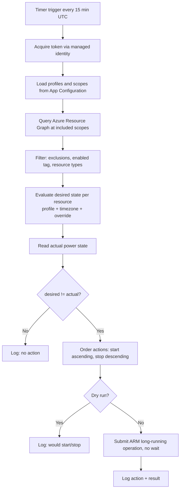

# Requirements Specification: Azure Resource Power Scheduler

| Item | Value |
|---|---|
| Document ID | AZ-PWRSCHED-RS-001 |
| Version | 0.4 (Single tenant-wide deployment) |
| Last updated | 2026-10-03 |
| Selected option | Option C – Azure Functions (timer-triggered reconciliation engine) |
| Infrastructure as Code | Terraform (`azurerm` provider 4.x) |
| Status | Draft – only OI-01 (deployment-time configuration) remains open |

## Table of Contents

1. [Executive Summary](#1-executive-summary)
2. [Business Objectives and Success Metrics](#2-business-objectives-and-success-metrics)
3. [Scope](#3-scope)
4. [Stakeholder Register](#4-stakeholder-register)
5. [Context and Target Architecture](#5-context-and-target-architecture)
6. [Configuration Model](#6-configuration-model)
7. [Functional Requirements](#7-functional-requirements)
8. [Resource Type Handler Requirements](#8-resource-type-handler-requirements)
9. [Business Rules](#9-business-rules)
10. [Non-Functional Requirements](#10-non-functional-requirements)
11. [Security Requirements](#11-security-requirements)
12. [Observability Requirements](#12-observability-requirements)
13. [Infrastructure as Code (Terraform) Requirements](#13-infrastructure-as-code-terraform-requirements)
14. [User Stories and Acceptance Criteria](#14-user-stories-and-acceptance-criteria)
15. [Assumptions and Dependencies](#15-assumptions-and-dependencies)
16. [Risks](#16-risks)
17. [Open Issues and Gaps](#17-open-issues-and-gaps)
18. [Glossary](#18-glossary)
19. [Change History](#19-change-history)

---

## 1. Executive Summary

The organisation runs non-production workloads in Azure spoke subscriptions under a Cloud Adoption Framework (CAF) management group hierarchy with a hub/spoke network. Many of these workloads run 24×7 although they are used only during business hours.

This specification defines a centrally managed **Resource Power Scheduler**. It automatically starts and stops supported Azure resources according to configurable schedules. The solution is an Azure Function App on a timer trigger, deployed with Terraform into the Management subscription. On each run it compares the desired power state of every opted-in resource with its actual state and corrects the difference (**reconciliation**).

The scheduler is flexible in three ways:

- **Schedule:** schedules are named profiles that can be changed without code changes.
- **Resource type:** the resource types in scope can be selected (VM, AKS, databases and others).
- **Scope:** scope can be set at management group, subscription or resource group level.

## 2. Business Objectives and Success Metrics

| ID | Objective | Success metric |
|---|---|---|
| OBJ-01 | Reduce compute cost of non-production workloads | ≥ 40% reduction in compute cost for in-scope resources within 3 months of rollout |
| OBJ-02 | Remove manual start/stop effort | Zero manual start/stop tickets for onboarded workloads |
| OBJ-03 | Change schedules quickly and safely | Schedule change effective within 1 reconciliation cycle (≤ 15 min) after deployment |
| OBJ-04 | Protect shared platform services | Zero incidents caused by the scheduler affecting Platform MG resources |
| OBJ-05 | Provide transparency | 100% of actions logged and queryable; monthly savings report available |

## 3. Scope

### 3.1 In scope

- Scheduled start/stop (power management) of the resource types listed in [Section 8](#8-resource-type-handler-requirements).
- Scope selection at management group, subscription and resource group level, with include and exclude lists.
- Tag-based opt-in, opt-out and temporary override (keep running or keep stopped) per resource, resource group or subscription.
- Named, timezone-aware schedule profiles with weekdays and run windows.
- Dry-run mode (evaluate and log only, no changes).
- Logging, alerting and reporting.
- Terraform code for all infrastructure, identity, RBAC and configuration.
- A README with Terraform CLI deployment steps.

### 3.2 Out of scope

- Scheduling of Platform MG resources (Connectivity, Identity, Management): Azure Firewall, VPN/ExpressRoute gateways, Bastion, domain controllers, DNS resolvers.
- Scaling or rightsizing logic beyond the actions defined in Section 8 (for example autoscale rules or SKU recommendations).
- Deletion or re-creation of resources.
- CI/CD pipeline automation (Jenkins or other). Deployment is by Terraform CLI in this phase.
- A self-service web portal UI (possible future phase).
- **On-demand HTTP endpoint** (`POST /api/run`): deferred to phase 2 (decision D-05). In phase 1, ad-hoc needs are handled with override tags (FR-025).
- Production workloads: always excluded, with no opt-in (decision D-06, BR-003).
- Azure Cosmos DB: has no stop/pause operation.
- **Public holiday calendars**: deferred to phase 2 (decision D-07). In phase 1, resources follow the normal weekday schedule on public holidays; owners can use a `stopped` override if needed.
- **Azure SQL Database** (all tiers, including serverless): out of scope (decision D-08).

## 4. Stakeholder Register

| Role | Interest | Responsibility |
|---|---|---|
| Cloud Platform Team | Owns the scheduler, platform safety | Build, deploy, operate; approve scope changes |
| FinOps / Cost Management | Cost savings | Define savings targets, consume reports |
| Application / Workload Owners | Availability during working hours | Tag resources, choose profiles, request overrides |
| Security / Governance | Least privilege, auditability | Approve RBAC model and custom role |
| Operations / Service Desk | Incident handling | Use runbooks; handle "resource not started" issues |

## 5. Context and Target Architecture

### 5.1 Landing zone context

```
Tenant Root Group
└── <org> (intermediate root MG)
    ├── Platform MG ............ EXCLUDED from scheduling
    │   ├── Connectivity (hub VNet, Firewall, Gateways, DNS)
    │   ├── Identity
    │   └── Management  ......... Scheduler is deployed here
    ├── Landing Zones MG ....... IN SCOPE (custom role assigned here)
    │   ├── Corp   (spoke subscriptions)
    │   └── Online (spoke subscriptions)
    ├── Sandbox MG ............. IN SCOPE (default schedule)
    └── Decommissioned MG ...... EXCLUDED
```

### 5.2 Solution components

| Component | Purpose |
|---|---|
| Resource group `rg-pwrsched-<region>` | Holds all scheduler resources (Management subscription) |
| Function App (Flex Consumption, Linux, Python 3.11) | Hosts the timer-triggered reconciliation function (an HTTP on-demand function is added in phase 2) |
| Storage account | Functions runtime storage (`AzureWebJobsStorage`), deployment package container, timer lease |
| User-assigned managed identity | Identity used for Azure Resource Manager (ARM), Resource Graph, App Configuration and Storage access |
| Azure App Configuration | Stores schedule profiles, scope include/exclude lists and global settings |
| Application Insights + Log Analytics workspace | Telemetry, action audit log, alerts (may reuse the central Management workspace) |
| Custom role "Resource Power Operator" | Least-privilege start/stop permissions, assigned at in-scope MGs |
| Action group | Alert notifications (email / Teams) |

### 5.3 Execution flow



## 6. Configuration Model

### 6.1 Resource tags

Tags can be set on a resource, a resource group or a subscription. The **most specific** value wins: resource, then resource group, then subscription.

| Tag key | Allowed values | Required | Description |
|---|---|---|---|
| `schedule-profile` | Name of a defined profile | Yes (to opt in) | Schedule profile applied to the resource |
| `schedule-enabled` | `true` \| `false` | No (default `true` when a profile is set) | Opt out without removing the profile |
| `schedule-override-state` | `running` \| `stopped` | No (default `running` when `schedule-override-until` is set) | State to hold while the override is active |
| `schedule-override-until` | ISO 8601 date-time with offset, e.g. `2026-10-10T21:00+07:00` | With `schedule-override-state` | Hold the override state until this time, then resume the schedule. Ignored when in the past. |
| `schedule-order` | Integer 1–9 | No (default per type, see 8.2) | Start order (ascending); stop runs in reverse |

### 6.2 Schedule profile schema (App Configuration)

Profiles are stored as JSON values under the key prefix `pwrsched:profiles:<name>`. The **standard profile** agreed for phase 1 is `weekday-0830-1730` (decision D-02):

```json
{
  "timezone": "Asia/Bangkok",
  "runWindows": [
    { "days": ["Mon", "Tue", "Wed", "Thu", "Fri"], "start": "08:30", "stop": "17:30" }
  ],
  "startOffsetMinutesByOrder": { "1": -30, "2": -15, "3": 0 }
}
```

Rules for profile values:

- `timezone` must be a valid IANA timezone name; each profile sets its own.
- Several `runWindows` per profile are allowed, for example a separate Saturday window.
- A window where `stop` is earlier than `start` crosses midnight (for example 20:00–02:00).
- `startOffsetMinutesByOrder` lets dependencies such as databases start earlier than the apps that use them. With the standard profile, databases (order 1) start at 08:00, AKS and Application Gateway (order 2) at 08:15, and VMs (order 3) at 08:30. Each step aligns with a 15-minute cycle.
- `Asia/Bangkok` is UTC+7 with no daylight saving time.
- Holiday calendars (`holidayCalendar`, `stopOnHolidays` fields) are added in phase 2 (FR-028).

### 6.3 Global settings (App Configuration)

| Key | Example | Description |
|---|---|---|
| `pwrsched:scopes:include` | `["/providers/Microsoft.Management/managementGroups/landingzones", "/providers/Microsoft.Management/managementGroups/sandbox"]` | Scopes to query |
| `pwrsched:scopes:exclude` | `["/providers/Microsoft.Management/managementGroups/platform"]` | Scopes always excluded (MG, subscription or RG IDs) |
| `pwrsched:resourceTypes` | `["vm","vmss","aks","postgres-flex","mysql-flex","sqlmi","appgw"]` | Enabled resource type handlers |
| `pwrsched:dryRun` | `true` | Global dry-run switch |
| `pwrsched:maxActionsPerRun` | `200` | Safety cap |

## 7. Functional Requirements

Priority uses MoSCoW: **M**ust, **S**hould, **C**ould, **W**on't (this phase).

### 7.1 Scheduling and execution

| ID | Requirement | Priority |
|---|---|---|
| FR-001 | The system shall run a reconciliation cycle on a timer, by default every 15 minutes. The interval shall be configurable through a Terraform variable (NCRONTAB expression in an app setting). | M |
| FR-002 | The system shall evaluate time in each profile's own IANA timezone, independently of the Function App timezone (UTC). | M |
| FR-003 | The system shall determine the desired state (`Running` or `Stopped`) of each resource from its profile, run windows and override tags. | M |
| FR-004 | The system shall act only when the desired state differs from the actual state (idempotent reconciliation). | M |
| FR-005 | The system shall submit start/stop operations asynchronously (no wait for completion) and verify the outcome in the next cycle. | M |
| FR-006 | The system shall honour start ordering (ascending `schedule-order`) and stop ordering (descending), including per-order start offsets from the profile. | S |
| FR-007 | When a run was missed (`IsPastDue`), the system shall run immediately on recovery and reconcile to the current desired state. | M |

### 7.2 Scope and selection

| ID | Requirement | Priority |
|---|---|---|
| FR-010 | The system shall discover resources using Azure Resource Graph across all configured include scopes (management group, subscription or resource group). | M |
| FR-011 | The system shall always skip resources under any exclude scope, even when they are tagged. | M |
| FR-012 | The system shall process only resource types enabled in `pwrsched:resourceTypes`. | M |
| FR-013 | The system shall resolve tags with precedence resource > resource group > subscription. | M |
| FR-014 | The system shall handle Resource Graph paging (more than 1,000 results). | M |

### 7.3 Overrides and on-demand operations

| ID | Requirement | Priority |
|---|---|---|
| FR-020 | While `schedule-override-until` is in the future, the system shall treat `schedule-override-state` (default `running`) as the desired state, and resume the schedule after it expires. | M |
| FR-021 | The system shall skip resources tagged `schedule-enabled=false`. | M |
| FR-025 | Phase 1 ad-hoc operations: an operator sets `schedule-override-state` and `schedule-override-until` on a resource, resource group or subscription. The next cycle (≤ 15 min) applies the override state. No separate manual start/stop is required. | M |
| FR-026 | The system shall log a warning for override tags with an invalid date or state, and ignore them. | M |

**Phase 2 backlog (Won't in phase 1, decisions D-05 and D-07):**

| ID | Requirement | Priority |
|---|---|---|
| FR-022 | The system shall expose an HTTP endpoint (`POST /api/run`) that accepts `action` (`start`/`stop`/`reconcile`), `scope`, `resourceTypes[]` and `dryRun`. | W |
| FR-023 | The HTTP endpoint shall require Microsoft Entra ID authentication and authorise callers by app role (`PowerScheduler.Operator`). | W |
| FR-024 | An on-demand `start` or `stop` shall set `schedule-override-state` to the requested state and `schedule-override-until` to now + 4 hours on the targeted resources (decision D-03). Requires `Microsoft.Resources/tags/write` for the managed identity. | W |
| FR-027 | Network exposure of the endpoint (private via hub, or public with Entra ID) shall be decided before phase 2 build. | W |
| FR-028 | Profiles shall support a public holiday calendar (`holidayCalendar`, `stopOnHolidays`), stored in `config/holidays/` and maintained yearly; resources stay stopped on listed dates (decision D-07). | W |

### 7.4 Safety

| ID | Requirement | Priority |
|---|---|---|
| FR-030 | The system shall support a global dry-run mode that logs intended actions without calling start/stop APIs. | M |
| FR-031 | The system shall stop processing actions after `maxActionsPerRun` is reached in one cycle and raise an alert. | M |
| FR-032 | The system shall refuse to act on a hard-coded deny list of resource types (Azure Firewall, virtual network gateways, Bastion, ExpressRoute circuits), regardless of configuration. | M |
| FR-033 | The system shall skip and log resources in a transitional state (e.g. `Starting`, `Stopping`, `Updating`) and retry in the next cycle. | M |

## 8. Resource Type Handler Requirements

### 8.1 Handler matrix

| Handler key | Azure resource type | Start action | Stop action | Default order | Priority |
|---|---|---|---|---|---|
| `vm` | `Microsoft.Compute/virtualMachines` | Start | **Deallocate** (not power-off) | 3 | M |
| `vmss` | `Microsoft.Compute/virtualMachineScaleSets` | Start | Deallocate | 3 | S |
| `aks` | `Microsoft.ContainerService/managedClusters` | Start cluster | Stop cluster | 2 | M |
| `postgres-flex` | `Microsoft.DBforPostgreSQL/flexibleServers` | Start | Stop | 1 | M |
| `mysql-flex` | `Microsoft.DBforMySQL/flexibleServers` | Start | Stop | 1 | M |
| `sqlmi` | `Microsoft.Sql/managedInstances` | Start | Stop | 1 | M |
| `appgw` | `Microsoft.Network/applicationGateways` | Start | Stop | 2 | C |
| `synapse-pool` | `Microsoft.Synapse/workspaces/sqlPools` | Resume | Pause | 1 | C |
| `sqldb` | `Microsoft.Sql/servers/databases` | – | – | – | Out of scope (D-08) |
| `appservice` | `Microsoft.Web/serverfarms` | Scale up | Scale down | 3 | W |

### 8.2 Handler-specific requirements

| ID | Requirement |
|---|---|
| HR-001 | VM: stop shall use deallocate. VMs with ephemeral OS disks shall be skipped and logged as unsupported. |
| HR-002 | AKS: the handler shall read `powerState.code` and act only when the cluster `provisioningState` is `Succeeded`. |
| HR-003 | PostgreSQL/MySQL Flexible: the platform auto-starts servers after 7 days stopped. The reconciliation shall re-stop them when the desired state is `Stopped`. |
| HR-004 | All database types with a stop operation are in scope, including high-availability servers and servers with read replicas (decision D-04). Where the platform rejects a stop or start because of HA or replica configuration, the handler shall log the reason, skip the resource, and not retry it until its configuration changes. Behaviour is validated during the pilot. |
| HR-005 | Each handler shall be a separate module implementing a common interface (`get_state`, `start`, `stop`) so new types can be added without changing the core engine. |
| HR-006 | Azure SQL Database is out of scope (decision D-08). No handler is built; the type is not queried, so tagging these databases has no effect. |

## 9. Business Rules

```
BR-001: Platform exclusion
Description : Resources under the Platform MG are never started or stopped.
Constraint  : Enforced by RBAC scope, exclude list and type deny list.
Source      : Cloud Platform Team

BR-002: Opt-in only
Description : A resource is managed only if a valid schedule-profile tag resolves for it.
Constraint  : Untagged resources are ignored.
Source      : Workload owners

BR-003: Production exclusion (hard rule)
Description : Resources in subscriptions tagged environment=prod are always skipped.
              There is no opt-in mechanism.
Constraint  : Enforced in the engine regardless of other tags or configuration.
Source      : Decision D-06

BR-004: Override precedence
Description : A valid future schedule-override-until always takes precedence over the schedule.
              The desired state is schedule-override-state (default Running).
Source      : Workload owners

BR-005: Unknown profile
Description : A tag referencing an undefined profile is treated as "no action" and logged as a warning.
Source      : Cloud Platform Team

BR-006: Reserved capacity
Description : Resources covered by Reserved Instances should not be onboarded.
Constraint  : Advisory; reported in the monthly savings report.
Source      : FinOps
```

## 10. Non-Functional Requirements

| ID | Category | Requirement |
|---|---|---|
| NFR-001 | Timeliness | A scheduled transition shall be **submitted** within 15 minutes of its scheduled time (one cycle). |
| NFR-002 | Performance | One cycle shall complete within 5 minutes for up to 2,000 in-scope resources. |
| NFR-003 | Reliability | Missed cycles shall self-heal on the next run (reconciliation). Failed actions shall be retried in each later cycle. |
| NFR-004 | Concurrency | Only one reconciliation cycle may run at a time (timer singleton lease). |
| NFR-005 | Throttling | The engine shall limit parallel ARM calls (default 10) and back off on HTTP 429 using the `Retry-After` header. |
| NFR-006 | Maintainability | New schedules or scopes shall require configuration changes only (Terraform `apply`), not code changes. |
| NFR-007 | Extensibility | New resource types shall be addable as a handler module plus a role-permission update. |
| NFR-008 | Cost | Run cost of the scheduler shall stay under USD 50/month (excluding a shared Log Analytics workspace). |
| NFR-009 | Testability | Desired-state evaluation shall be a pure function covered by unit tests (timezones, midnight crossing, overrides). |
| NFR-010 | Portability | All infrastructure shall be reproducible from Terraform in a new tenant. One scheduler instance is deployed per tenant; an optional `name_suffix` allows a second instance where genuinely needed. |

## 11. Security Requirements

| ID | Requirement |
|---|---|
| SEC-001 | The Function App shall authenticate to Azure **only** through a user-assigned managed identity. No client secrets, connection strings or storage account keys. |
| SEC-002 | A custom role **Resource Power Operator** shall contain only read actions plus the start/stop actions of enabled handlers (see 11.1). |
| SEC-003 | The custom role shall be assigned only at in-scope management groups (Landing Zones, Sandbox), never at Tenant Root, the intermediate root or Platform. |
| SEC-004 | The managed identity shall have **App Configuration Data Reader** on the App Configuration store and the required Storage data roles on the runtime storage account. |
| SEC-005 | The storage account shall disable shared-key access and public blob access, and enforce TLS 1.2 or later. |
| SEC-006 | The Function App shall enforce HTTPS only, minimum TLS 1.2 and FTP disabled. Phase 1 exposes no HTTP-triggered functions; the timer function is not callable externally. |
| SEC-007 | Private endpoints and VNet integration shall be **configurable** (Terraform variable) for Storage and App Configuration to align with the hub/spoke design. |
| SEC-008 | All write actions shall be traceable in the Azure Activity Log under the managed identity and in the scheduler's own audit log. |

### 11.1 Custom role permissions (initial)

```
Microsoft.Resources/subscriptions/resourceGroups/read
Microsoft.ResourceGraph/resources/read
Microsoft.Compute/virtualMachines/read
Microsoft.Compute/virtualMachines/instanceView/read
Microsoft.Compute/virtualMachines/start/action
Microsoft.Compute/virtualMachines/deallocate/action
Microsoft.Compute/virtualMachineScaleSets/read
Microsoft.Compute/virtualMachineScaleSets/start/action
Microsoft.Compute/virtualMachineScaleSets/deallocate/action
Microsoft.ContainerService/managedClusters/read
Microsoft.ContainerService/managedClusters/start/action
Microsoft.ContainerService/managedClusters/stop/action
Microsoft.DBforPostgreSQL/flexibleServers/read
Microsoft.DBforPostgreSQL/flexibleServers/start/action
Microsoft.DBforPostgreSQL/flexibleServers/stop/action
Microsoft.DBforMySQL/flexibleServers/read
Microsoft.DBforMySQL/flexibleServers/start/action
Microsoft.DBforMySQL/flexibleServers/stop/action
Microsoft.Sql/managedInstances/read
Microsoft.Sql/managedInstances/start/action
Microsoft.Sql/managedInstances/stop/action
Microsoft.Network/applicationGateways/read
Microsoft.Network/applicationGateways/start/action
Microsoft.Network/applicationGateways/stop/action
```

> 📝 Note: Verify exact action names against the current Azure resource provider operations list before finalising the role. Add Synapse permissions only if the `synapse-pool` handler is enabled.

## 12. Observability Requirements

| ID | Requirement |
|---|---|
| OBS-001 | Each evaluated resource shall produce one structured log record: `runId`, `resourceId`, `type`, `profile`, `desiredState`, `actualState`, `action`, `dryRun`, `result`, `error`. |
| OBS-002 | Each cycle shall produce a summary record: counts of evaluated, started, stopped, skipped and failed resources, and duration. |
| OBS-003 | An alert shall fire when a cycle fails or does not run for more than 45 minutes. |
| OBS-004 | An alert shall fire when the same resource fails an action in 3 consecutive cycles. |
| OBS-005 | An alert shall fire when `maxActionsPerRun` is reached. |
| OBS-006 | An Azure Workbook (or saved KQL queries) shall show actions per subscription and estimated hours saved. |

## 13. Infrastructure as Code (Terraform) Requirements

| ID | Requirement |
|---|---|
| IAC-001 | All Azure resources, the role definition, role assignments and App Configuration keys shall be defined in Terraform. |
| IAC-002 | Terraform state shall be stored remotely in an Azure Storage backend with Entra ID authentication (`use_azuread_auth = true`) and state locking. |
| IAC-003 | The code shall be organised as a single tenant-wide root module (`infra/scheduler`) plus reusable modules: `function_app`, `rbac`, `app_config`, `monitoring`. One scheduler manages the whole tenant's in-scope (non-production) estate. |
| IAC-004 | Schedule profiles and global settings shall be maintained in versioned files (`config/profiles/*.json`, `config/settings.json`) and loaded into App Configuration by Terraform. |
| IAC-005 | Provider versions shall be pinned (`azurerm ~> 4.x`, `azuread ~> 3.x`, Terraform `>= 1.9`). |
| IAC-006 | All scheduler resources shall carry standard tags: `owner`, `cost-centre`, `project`, `managed-by=terraform`. (The `environment=prod` tag on *workload* subscriptions drives the production hard-exclusion, BR-003, and is separate from these.) |
| IAC-007 | Function code shall be packaged as a zip and deployed after infrastructure creation using the documented CLI command (see README). |
| IAC-008 | `terraform plan` shall show no changes after a successful apply (no drift-by-design), except for App Configuration keys changed intentionally. |

### 13.1 Key Terraform input variables

| Variable | Type | Description |
|---|---|---|
| `subscription_id` | string | Management subscription hosting the scheduler |
| `location` | string | Azure region |
| `name_suffix` | string | Optional short suffix for resource names; empty for the single tenant-wide instance |
| `role_assignable_scope` | string | Parent (intermediate/org) MG that is the assignable scope for the custom role |
| `in_scope_management_group_ids` | list(string) | MGs where the custom role is assigned and resources are queried |
| `excluded_scope_ids` | list(string) | MG/subscription/RG IDs always excluded |
| `enabled_resource_types` | list(string) | Handler keys to enable |
| `reconcile_schedule` | string | NCRONTAB expression, default `0 */15 * * * *` |
| `dry_run` | bool | Global dry-run switch, default `true` |
| `max_actions_per_run` | number | Safety cap, default `200` |
| `log_analytics_workspace_id` | string | Existing central workspace (optional) |
| `enable_private_networking` | bool | Create private endpoints and VNet integration |
| `integration_subnet_id` | string | Subnet for Function App VNet integration (when private) |
| `alert_email_addresses` | list(string) | Action group recipients |
| `tags` | map(string) | Standard resource tags |

## 14. User Stories and Acceptance Criteria

### US-01 Scheduled stop of a VM

```
As a workload owner,
I want my dev VMs to be deallocated outside office hours,
So that we do not pay for idle compute.

Given a VM tagged schedule-profile=weekday-0830-1730 and currently Running
When  a reconciliation cycle runs on Friday at 17:30 Bangkok time
Then  the VM deallocate operation is submitted
And   an audit record with action=stop and result=submitted is written

Priority: Must
```

### US-02 Temporary override for a release

```
As a workload owner,
I want to keep my UAT environment running late tonight,
So that the release test can finish.

Given resources tagged schedule-override-state=running
And   schedule-override-until=<today 21:00+07:00>
When  cycles run between 17:30 and 21:00
Then  the resources are not stopped
And   the first cycle after 21:00 stops them

Priority: Must
```

### US-03 Dependency-ordered start

```
As a workload owner,
I want my database to be started before my AKS cluster,
So that applications start without connection errors.

Given a PostgreSQL Flexible Server (order 1) and an AKS cluster (order 2) on the same profile
And   the profile defines startOffsetMinutesByOrder {"1": -30, "2": -15}
When  the cycle runs at 08:00 Bangkok time
Then  only the database start is submitted
And   the AKS start is submitted in the 08:15 cycle

Priority: Should
```

### US-04 Platform safety

```
As the platform team,
I want platform resources never to be touched,
So that the hub network and shared services stay available.

Given an Azure Firewall in the Connectivity subscription tagged schedule-profile=weekday-0830-1730
When  any reconciliation cycle runs
Then  no action is submitted for the firewall
And   a warning "excluded scope/type" is logged

Priority: Must
```

### US-05 Change a schedule

```
As the platform team,
I want to change a profile's stop time from 17:30 to 17:00,
So that we save more cost.

Given the profile JSON is updated and terraform apply completes
When  the next cycle runs at or after 17:00
Then  resources on that profile are stopped
And   no function code redeployment was required

Priority: Must
```

### US-06 Ad-hoc stop during business hours (phase 1, tag-based)

```
As a workload owner,
I want to stop my test environment for the afternoon,
So that we save cost while nobody uses it.

Given a resource group on profile weekday-0830-1730
And   I tag it schedule-override-state=stopped, schedule-override-until=<today 17:30+07:00>
When  the next cycle runs (within 15 minutes)
Then  its resources are stopped
And   they are not restarted by later cycles that day
And   the schedule resumes normally the next working day

Priority: Must
```

### US-07 Production is never touched

```
As the governance team,
I want production subscriptions excluded without exception,
So that the scheduler cannot cause a production outage.

Given a VM tagged schedule-profile=weekday-0830-1730
And   its subscription is tagged environment=prod
When  any reconciliation cycle runs
Then  no action is submitted
And   a log record with reason "production-excluded" is written

Priority: Must
```

## 15. Assumptions and Dependencies

| ID | Assumption / dependency |
|---|---|
| A-01 | The deployer has Owner (or Contributor + User Access Administrator) on the Management subscription. |
| A-02 | The deployer can create custom role definitions and role assignments at the in-scope management groups. |
| A-03 | Flex Consumption plan is available in the chosen region. If not, an Elastic Premium (EP1) plan is used as a fallback. |
| A-04 | A central Log Analytics workspace exists in the Management subscription (optional; otherwise one is created). |
| A-05 | Workload owners are responsible for tagging their resources with valid profiles. |
| A-06 | Azure Policy for tag inheritance and allowed values will be delivered as a separate governance work item. |
| A-07 | Outbound access from the Function App to Azure Resource Manager (`management.azure.com`) and Microsoft Entra ID is permitted (through the hub firewall if VNet-integrated). |
| A-08 | All production subscriptions carry the tag `environment=prod`, enforced by Azure Policy. BR-003 depends on this. |

## 16. Risks

| ID | Risk | Impact | Likelihood | Mitigation |
|---|---|---|---|---|
| R-01 | Mis-scoped role assignment allows stopping platform resources | High | Low | MG-scoped assignment, exclude list, type deny list, code review |
| R-02 | Resources not started in time for business hours (AKS start takes 5–10 min) | Medium | Medium | Start offsets per order, alert on failed starts |
| R-03 | ARM throttling in large estates | Medium | Low | Resource Graph discovery, bounded parallelism, back-off |
| R-04 | Applications fail after restart due to dependency order | Medium | Medium | `schedule-order`, offsets, owner testing during pilot |
| R-05 | Stopping RI-covered resources gives no saving | Low | Medium | BR-006, FinOps report |
| R-06 | Wrong timezone configuration | Medium | Low | Unit tests, dry-run pilot, profile review |
| R-07 | AKS stopped beyond the platform's maximum stopped duration | High | Very low | Alert on clusters stopped longer than 30 days |
| R-08 | Resources run unused on public holidays until phase 2 | Low | High | Owners set a `stopped` override for long holidays; FR-028 in phase 2 |

## 17. Open Issues and Gaps

| ID | Issue | Owner | Status |
|---|---|---|---|
| OI-01 | In-scope management groups and excluded subscriptions. To be set in `terraform.tfvars` (`in_scope_management_group_ids`, `excluded_scope_ids`) before deployment. | Platform Team | Open – deployment-time configuration |
| OI-02 | Standard schedule profile | Platform Team / FinOps | Closed – D-02 |
| OI-03 | On-demand start/stop behaviour | Platform Team | Closed – D-03 (applies in phase 2) |
| OI-04 | HA databases and SQL MI scope | Workload Owners | Closed – D-04 |
| OI-05 | On-demand endpoint exposure | Security | Closed – D-05 (deferred to phase 2; exposure re-assessed then, FR-027) |
| OI-06 | Production opt-in | Governance | Closed – D-06 |
| OI-07 | Function runtime language | Platform Team | Proposed – Python 3.11 (PowerShell 7.4 alternative) |
| OI-08 | Public holiday handling | FinOps / Platform Team | Closed – D-07 (phase 2) |
| OI-09 | Azure SQL Database handling | Workload Owners / FinOps | Closed – D-08 (out of scope) |

### 17.1 Decision log

| ID | Date | Decision |
|---|---|---|
| D-01 | 2026-10-03 | Option C selected: Azure Functions (Flex Consumption) deployed with Terraform CLI. |
| D-02 | 2026-10-03 | Standard schedule: 08:30–17:30, Monday–Friday, `Asia/Bangkok`. Profile name `weekday-0830-1730`. |
| D-03 | 2026-10-03 | On-demand start/stop sets an automatic 4-hour override. |
| D-04 | 2026-10-03 | All database types with a stop operation are in scope, including HA servers and SQL MI. |
| D-05 | 2026-10-03 | On-demand HTTP endpoint deferred to phase 2. Phase 1 uses override tags. |
| D-06 | 2026-10-03 | No production opt-in; production subscriptions are always excluded. |
| D-07 | 2026-10-03 | Public holiday calendars deferred to phase 2. |
| D-08 | 2026-10-03 | Azure SQL Database is out of scope. |

## 18. Glossary

| Term | Definition |
|---|---|
| Reconciliation | Comparing the desired state with the actual state and acting only on differences |
| Profile | Named schedule definition (run windows, timezone, start offsets) |
| Desired state | `Running` or `Stopped`, computed from the profile at a point in time |
| Flex Consumption | Azure Functions hosting plan with per-execution billing and VNet support |
| NCRONTAB | Six-field CRON format (including seconds) used by Azure Functions timer triggers |
| Resource Graph | Azure service for querying resources across subscriptions and management groups |
| LRO | Long-running operation; an ARM request that completes asynchronously |
| MG | Management group |

## 19. Change History

| Version | Date | Changes |
|---|---|---|
| 0.1 | 2026-10-03 | Initial draft |
| 0.2 | 2026-10-03 | Incorporated decisions D-02 to D-06: standard Bangkok profile, override state tag, all databases in scope, on-demand endpoint deferred to phase 2, production hard-excluded. Added OI-08 (holidays) and OI-09 (Azure SQL Database). |
| 0.3 | 2026-10-03 | Decisions D-07 (holidays to phase 2, FR-028) and D-08 (Azure SQL Database out of scope). Removed holiday fields from the phase 1 profile schema. Added risk R-08. |
| 0.4 | 2026-10-03 | Single tenant-wide deployment: one scheduler per tenant (`infra/scheduler`) with an optional `name_suffix`, replacing per-environment (dev/prod) roots. Updated IAC-003, IAC-006, NFR-010, §5.2 and §13.1 (`environment` → `name_suffix` + `role_assignable_scope`). Production remains hard-excluded (BR-003). |
